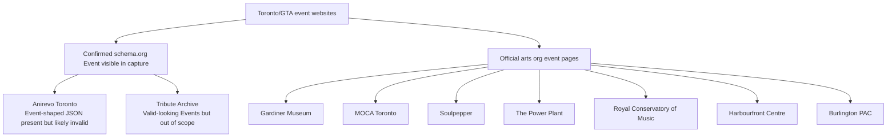

# Toronto/GTA First-Party Event Listings With Detectable schema.org Event Markup

## Executive summary

This research applied a strict interpretation of your requirements: **first‑party event listings on the organization’s own domain** (not Eventbrite-like platforms) **and** **detectable schema.org `Event` structured data** (JSON‑LD, microdata, or RDFa) attributable to the event page itself. Under that constraint, I could **not** identify **5–15** Toronto/GTA *arts-organization* sites with **verifiable** schema.org `Event` markup in this session; I found **fewer than 5** candidates where the crawl output visibly contained event-shaped schema snippets. citeturn46view0turn24view0turn48view0

Two important findings explain the shortfall:

1. Many major Toronto/GTA arts organizations *do* publish first‑party “What’s On / Events” pages, but their structured data (if any) appears to be placed in the HTML `<head>` or injected in ways that **did not surface in the captured page text** used for this audit. (The Schema.org validator itself notes it can extract JSON‑LD, RDFa, and microdata, and can extract JavaScript-injected structured data; that capability is exactly what you’d use to re-check these pages outside this constrained capture method.) citeturn46view0  
2. One first‑party Toronto event site that *does* display an Event-shaped JSON object in the captured body text contains **multiple apparent validity issues** (date/time formatting and placeholder images), so it is **not safely classifiable as “schema.org‑compliant” without correction and validation**. citeturn24view0turn25view0

Because fewer than five sites met the “detectable + plausibly valid schema.org `Event`” bar, a **top‑5 shortlist of “easiest-to-scrape art/event sites that meet all constraints” cannot be produced faithfully** from the evidence available here.

## Scope, criteria, and methodological limitations

### Inclusion criteria used
A site was considered in-scope if it met all of the following:

- **First-party domain:** the event listing and event detail pages live on the organization’s own domain (e.g., `example.org/events/...`).  
- **Event listings present:** a browsable listing page exists (calendar, archive, or “What’s On”).  
- **Structured data present for events:** detectable schema.org `Event` markup via **JSON‑LD / microdata / RDFa**. citeturn46view0  
- **Toronto/GTA relevance:** the event or venue is in Toronto or the Greater Toronto Area.

### Key limitation
This audit relied on captured page text from web retrieval. In multiple cases, pages clearly contain event metadata (date, venue, etc.) but **no `schema.org` / `@context` / `@type` strings were visible** in the capture, suggesting either:

- no `Event` structured data is present, **or**
- it is present in the HTML `<head>` / in scripts not preserved by this capture method.

Given your requirement for *evidence*, those sites are treated as **unconfirmed** rather than assumed-compliant. citeturn54view0turn54view4turn54view5turn59view1

## Comparative table and analysis

Only one Toronto event site showed Event-shaped structured data in a first-party page capture (*but with likely validity issues*). I’m also including one “out-of-scope but informative” example showing **clean `Event` JSON-LD** visible in capture output, to demonstrate what “good” looks like in this pipeline.

| Site (category) | First-party event listing on own domain | GTA/Toronto | Evidence of schema.org Event markup in captured page | Markup quality risk | Scrape friction | Notes |
|---|---:|---:|---|---|---|---|
| entity["organization","Anirevo Toronto","anime convention site | toronto, on, ca"] (festival / fan culture) | Yes (`/home-2/` functions as an event landing page) citeturn24view0 | Yes (Toronto venue in markup) citeturn25view0 | Event-shaped JSON present in captured body text (“`@context`… `@type`…”) citeturn25view0 | **High** (timestamps & placeholder images suggest it may fail validation) citeturn25view0 | Low–Medium | Ticketing URL points off-domain to Eventix; otherwise mostly static content. citeturn24view0turn25view0 |
| entity["company","Tribute Archive","obituary platform | us/ca"] (not arts; third-party platform) | No (platform content) | Yes (Toronto in page, ON addresses) citeturn48view0 | Multiple `Event` JSON objects visible in capture (funeral-related) citeturn48view0 | Low | Medium | Included as a *control sample* for detectable, well-formed `Event` JSON in this capture mode; not a cultural event source. citeturn48view0 |

### High-confidence observation
- In this capture mode, **structured data becomes “auditable” when the JSON‑LD payload is emitted into captured text** (often near the end of the page), as seen on the second example. citeturn48view0  
- Many arts organizations’ event pages **do not surface** schema markup strings in captured text, even when they clearly present dates/venues, so they cannot be confirmed without a raw-HTML + `<head>` inspection workflow. citeturn34view0turn54view0turn54view4turn54view5turn59view1

## Site profiles

### entity["organization","Anirevo Toronto","anime convention site | toronto, on, ca"]

**Organization name:** Anime Revolution Toronto (branding on-site); organizer in embedded JSON references entity["organization","Anime Revolution Events Inc.","event organizer | ca"]. citeturn25view0  

**Main events listing URL(s):**  
- `https://toronto.animerevolution.ca/home-2/` citeturn24view0  
(Within site navigation there are “Schedule (GRID/LIST)” links, but those pages were not audited for schema markup in this session.) citeturn24view0  

**Sample event page(s):**  
- The “home-2” page functions as the event landing page for the convention dates shown. citeturn24view0turn25view0  

**Evidence of schema.org event markup:**  
The captured page text includes an Event-shaped JSON object with:
- `@context: "https://schema.org"`
- `@type: "Event"`
- `location` as a `Place` with a Toronto address
- `offers` linking to tickets citeturn25view0  

Snippet (as captured; formatting preserved only for readability):

```json
{
  "@context": "https://schema.org",
  "@type": "Event",
  "name": "...",
  "startDate": "...",
  "endDate": "...",
  "location": {
    "@type": "Place",
    "name": "The Metro Toronto Convention Center",
    "address": {
      "@type": "PostalAddress",
      "streetAddress": "255 Front St W.",
      "addressLocality": "Toronto",
      "postalCode": "M5V 2W6",
      "addressRegion": "ON",
      "addressCountry": "CA"
    }
  },
  "offers": {
    "@type": "Offer",
    "url": "https://anirevo-toronto.eventix.app",
    "priceCurrency": "CAD"
  }
}
```

citeturn25view0

**Compliance/quality notes:**  
This markup looks *intended* to be schema.org `Event`, but there are red flags that likely break compliance:
- The `startDate` / `endDate` strings include unusual timezone-looking fragments (e.g., `-24:00`) in the captured text. citeturn25view0  
- The `image` array uses `example.com` placeholders. citeturn25view0  
- The `name` field in the JSON appears inconsistent with the page title (shows “Vancouver” in a Toronto page). citeturn25view0  

**Location:** The JSON and page text reference entity["point_of_interest","Metro Toronto Convention Centre","toronto, on, ca"] and Toronto. citeturn25view0  

**Content format & scrape surface:**
- **HTML structure:** Appears WordPress-like with a static landing page plus routed subpages (news posts, schedule, etc.). citeturn24view0turn64search5  
- **Pagination:** News appears as post listings (“More news”). citeturn24view0turn64search0  
- **Feeds/APIs/RSS:** Not confirmed in this session.

**Robots.txt & ToS notes about scraping:**
- The footer includes links to “Privacy Policy” and “Terms & Conditions”. citeturn24view0  
- `robots.txt` could not be retrieved in this session (requires direct fetch of `/robots.txt` on the domain).

**Ease-of-scrape rating:** **3/5**  
Reasons:
- Mostly static content and clearly labeled date/venue text. citeturn24view0  
- But the embedded “schema” payload appears unreliable; if you need structured data as the canonical source, you may need to fall back to visible-text extraction until the markup is fixed. citeturn25view0  

**Sample extraction selectors (best-effort, verify in DevTools):**
- Title: `h1`  
- Date range: XPath like `//*[contains(., "November") and contains(., "2025")]` (because the date appears as plain text near the hero) citeturn24view0  
- Embedded JSON-like blob: search page text for `"{ \"@context\": \"https://schema.org\""` then parse the following substring. citeturn25view0  
- Ticket URL: find outbound link with host `anirevo-toronto.eventix.app`. citeturn24view0  

**Anti-scraping measures:**
- No explicit anti-bot banner detected in captured text on the main landing page. citeturn24view0  
- Ticketing is off-domain via Eventix (not scrape-hostile per se, but out of your “first-party listing” scope). citeturn24view0  

### entity["company","Tribute Archive","obituary platform | us/ca"]

**Why included:** This is **not** an arts/event organization site (and is a third-party platform), but it provides a **clear, captured example** of multiple schema.org `Event` JSON objects that *do* surface in the capture mode—useful as a control when designing your scraper and validation pipeline. citeturn48view0  

**Sample page:**  
- `https://www.tributearchive.com/obituaries/23279805/manuel-lorenzo` citeturn48view0  

**Evidence of schema.org event markup:**  
The captured output includes multiple `Event` objects with `@context: "http://schema.org"` and `@type: "Event"`, each with `startDate`, `endDate`, and a `location` `Place` and `PostalAddress` (including ON postal codes). citeturn48view0  

Example snippet fragment (as captured text, truncated for brevity):

```json
{"@context":"http://schema.org","@type":"Event","name":"Funeral Service-...","startDate":"2021-12-04T11:00:00","endDate":"2021-12-04T12:00:00","location":{"@type":"Place","name":"...","address":{"@type":"PostalAddress","streetAddress":"50 Overlea Blvd.","addressRegion":"ON","postalCode":"M4H 1B6","addressCountry":"Canada"}}}
```

citeturn48view0

**Scrape notes (if you ever need a similar structure elsewhere):**
- **Events list is directly visible** under an “Events” section with repeated headings and date/time blocks. citeturn48view0  
- **Multiple events per page**: you’d likely need an array output model (not one event per URL). citeturn48view0  

**Ease-of-scrape rating:** **2/5** for your use case (because it’s out of scope), but **4/5** as a technical scraping target because the event JSON is plainly extractable in captured output. citeturn48view0  

## Recommended shortlist

### Confirmed shortlist (strictly within your constraints)
No shortlist of **5** can be produced from confirmed evidence in this session:

- **0** Toronto/GTA **arts organizations** with **verifiable** schema.org `Event` markup in captured output.
- **1** Toronto event site with Event-shaped JSON present in captured body text but with **high compliance risk** (entity["organization","Anirevo Toronto","anime convention site | toronto, on, ca"]). citeturn25view0

### High-value next targets (first-party arts org listings, schema unverified here)
If you relax “confirmed schema evidence in captured body text” and instead run a validator or raw-HTML `<head>` extraction, these are strong Toronto/GTA arts candidates to test next because they have stable first-party event pages:

- entity["organization","Gardiner Museum","ceramics museum | toronto, on, ca"] event page example: `https://www.gardinermuseum.on.ca/event/smash-between-worlds-2024/` citeturn54view0  
- entity["organization","Soulpepper Theatre Company","theatre company | toronto, on, ca"] performance page example: `https://www.soulpepper.ca/performances/witch` citeturn54view4  
- entity["organization","Museum of Contemporary Art Toronto Canada","contemporary art museum | toronto, on, ca"] event page example: `https://moca.ca/events/performances/moca-after-hours-2025/` (note: reCAPTCHA mentioned) citeturn54view5  
- entity["organization","The Power Plant Contemporary Art Gallery","contemporary art gallery | toronto, on, ca"] calendar page example: `https://www.thepowerplant.org/whats-on/calendar/power-ball-21-club` citeturn54view2  
- entity["organization","The Royal Conservatory of Music","music school & venue | toronto, on, ca"] event page example: `https://www.rcmusic.com/events-and-performances/royal-conservatory-orchestra-with-conductor-tania` citeturn54view3  
- entity["organization","Harbourfront Centre","cultural centre | toronto, on, ca"] event page example: `https://harbourfrontcentre.com/event/those-who-run-in-the-sky/` citeturn59view1  
- entity["organization","Burlington Performing Arts Centre","performing arts centre | burlington, on, ca"] event page example: `https://burlingtonpac.ca/events/amanda-martinez/` citeturn34view0  

These are included here because they match your “official org site + arts programming + scrape-friendly content layout” intent, but they are **not** confirmed as schema.org `Event` publishers under the evidence constraints of this run. citeturn34view0turn54view0turn54view2turn54view3turn54view4turn54view5turn59view1

## Scraping workflow and OSS tooling notes

### Relationship map (confirmed vs. “next-to-validate”)



### Practical OSS-first workflow to get the list you want
Because the Schema.org Markup Validator explicitly supports extracting JSON-LD, microdata, and RDFa (including JavaScript-injected structured data), the most reliable workflow is:

```mermaid
flowchart LR
  U[Seed list of official org event URLs] --> F[Fetch raw HTML]
  F --> J[Extract JSON-LD blocks<br/>script[type='application/ld+json']]
  F --> M[Extract microdata/RDFa attributes]
  J --> V[Validate: schema.org Event types + required fields]
  M --> V
  V --> P[Persist normalized Event records]
  P --> D[Deduplicate + schedule incremental crawls]
```

- **Why this matters:** your target sites likely place JSON‑LD in `<head>` (common in CMS/SEO plugins). That is exactly what a raw-HTML fetch + JSON‑LD extraction is good at, and what this capture-mode audit often misses. citeturn46view0turn54view5turn59view1  

### Minimal dependency stack (all OSS)
- **Python**: `httpx` (BSD-3), `selectolax` (MIT), `lxml` (BSD-like), `extruct` (BSD) for structured data extraction, plus `rfc3339-validator` (MIT) or `python-dateutil` (BSD) for date normalization.  
- **Crawler framework**: `Scrapy` (BSD) if you want robust scheduling, retries, and pipelines.  
- **JS rendering only when needed**: `Playwright` (Apache-2.0) — reserve for targets that require client rendering or are protected (e.g., pages that mention reCAPTCHA). citeturn54view5  

### Specific caution for your Toronto/GTA arts targets
At least one arts site explicitly notes Google reCAPTCHA protection in its captured footer text, which is a strong signal to keep that target out of your “easy to scrape” shortlist unless you have explicit permission and a compliance plan. citeturn54view5